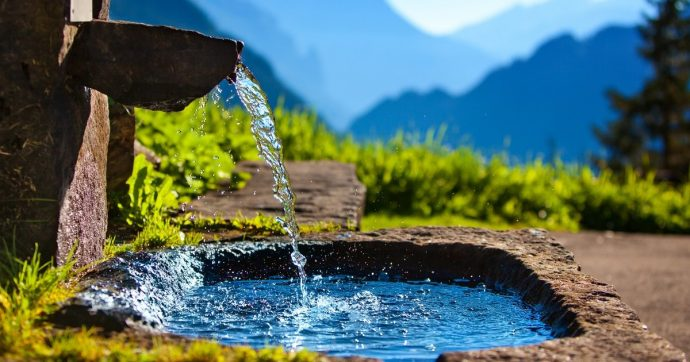

# Data Science Portfolio - Danilo Russo
Questo Portfolio contiene tutti i miei progetti di Data Science e Data Analysis, svolti durante il master in Data Science di Start2Impact più altri progetti personali svolti con lo scopo di migliorare le mie capacità e conoscenze.

- **Email**: [danilo08russo@gmail.com](danilo08russo@gmail.com)
- **LinkedIn**: [linkedin.com/danilo-russo95](https://www.linkedin.com/in/danilo-russo95/)

## Progetti
**[Analisi Acqua Potabile](https://github.com/danilorusso08/Analisi_Acqua_Potabile)**

In questo progetto, l'obiettivo è quello di costruire un modello predittivo per determinare la potabilità dell'acqua in base alle sue caratteristiche chimiche. 
Abbiamo applicato diversi algoritmi di classificazione, come *Logistic Regression, Random Forest, k-nearest Neighbors, Gradient Boosting e Decision Tree* utilizzando due diversi approcci al fine di ottenere il miglior modello con i dati a nostra disposizione.

#

**[Wine](https://github.com/danilorusso08/Wine)**

Nel progetto, abbiamo costruito un modello di classificazione per prevedere il produttore di vino tra tre produttori diversi, basandoci sulle caratteristiche chimiche del vino.  
Prima di costruire il modello, abbiamo effettuato un'analisi dei dati per comprendere le caratteristiche del dataset. In particolare, abbiamo visualizzato le distribuzioni delle feature e le correlazioni tra di esse. 
Il modello di classificazione scelto è il RandomForestClassifier e per ottimizzarne le prestazioni, abbiamo eseguito il tuning degli iperparametri tramite la tecnica di GridSearchCV.  

Grazie all'implementazione di questo modello di classificazione, siamo stati in grado di ottenere previsioni accurate per ciascuna variante nel dataset. 

#

**[World Happiness Report - The Human Freedom Index](https://github.com/danilorusso08/World_Happiness__Freedom)**

In questo progetto, ci concentreremo sull'analisi dei fattori principali che influenzano il livello di felicità in uno stato, utilizzando il World Happiness Report. Inoltre, utilizzeremo i dati forniti dal Human Freedom Index per valutare il grado di libertà esistente nel mondo. 
Per questo, combineremo e manipoleremo i diversi dataset, al fine di identificare le correlazioni tra felicità e libertà.  
Per questo progetto, faremo uso di diverse librerie, tra cui pandas, matplotlib, seaborn e plotly. 

#

**[File Organizer](https://github.com/danilorusso08/File_Organizer)**

Script Python che iteri in ordine alfabetico sui file della cartella files e, a seconda del tipo (audio, documento, immagine), li sposti nella relativa sottocartella. Se la sottocartella non esiste, lo script dovrà crearla automaticamente.

 

## Competenze

- **Linguaggi**: Python (Pandas, Numpy, Scikit-Learn, Scipy, Matplotlib, Seaborn, Plotly), SQL, Javascript
- **Tools**: Git, MS Exce, Officel
